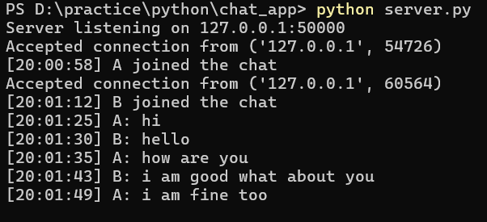
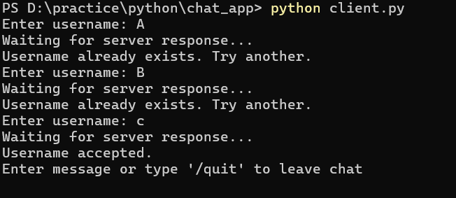
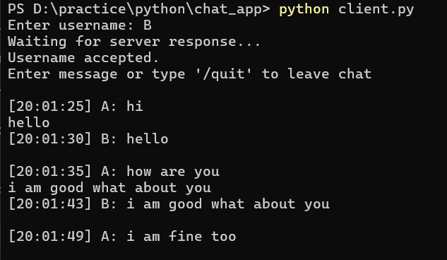
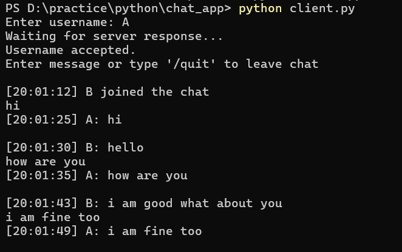
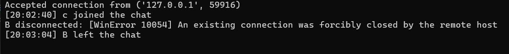

# Multi-Client Chat Application using Python Sockets

A real-time multi-client chat application built with Python using sockets and threading.

## Features

- Multi-client real-time chat
- TCP socket-based communication
- Unique username validation
- Join and leave notifications
- Message timestamps `[HH:MM:SS]`
- Concurrent client handling using multithreading
- Graceful exit using `/quit`

## Technologies Used

- Python
- Socket Programming
- TCP/IP
- Multithreading

## Project Structure

```text
chat_app/
├── server.py
├── client.py
├── README.md
└── screenshots/
```

## Requirements

- Python 3.x
- No external libraries — uses only built-in modules (`socket`, `threading`, `datetime`)

## How to Run

**1. Start the server**
```bash
python server.py
```

**2. Start a client** (open a new terminal for each user)
```bash
python client.py
```

**3. Enter a username when prompted**

**4. Start chatting!**

To exit, type `/quit`

## Screenshots

**Server Running**



**Username Validation**



**Chat**




**Join and Leave Notifications**



## How It Works

- Server listens on `127.0.0.1:50000`
- The server creates a dedicated thread for each connected client, enabling multiple users to communicate simultaneously.
- Client uses a background thread to receive messages while the main thread handles input
- Timestamps are added server-side for consistency across all clients
- Your own messages are timestamped locally since the server doesn't echo them back to you

## Concepts Learned

- TCP/IP networking
- Socket programming
- Multithreading in Python
- Client-server architecture
- Concurrent connection handling
- Exception handling
   
## Limitations

- Works on localhost only (`127.0.0.1`) — not over the internet
- No message history for new joiners
- No encryption
-  No private messaging between users
